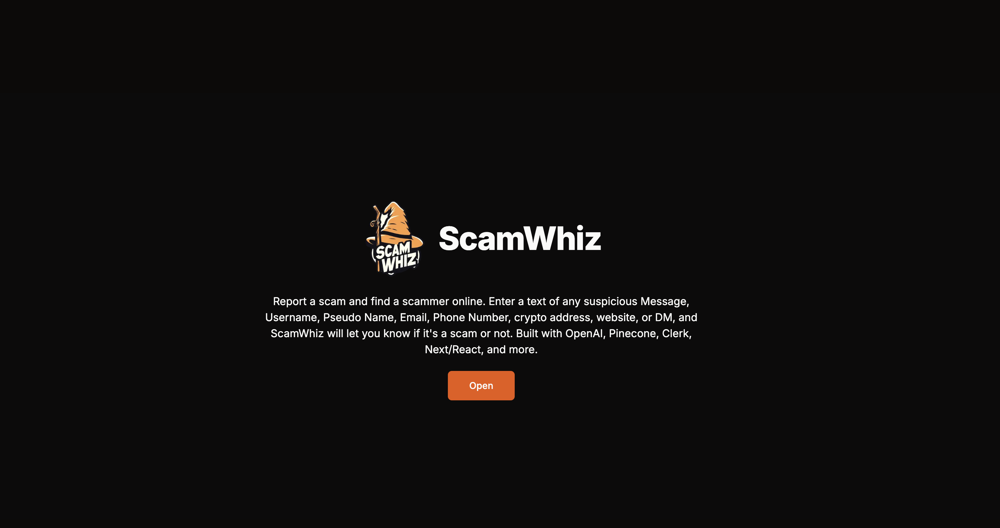
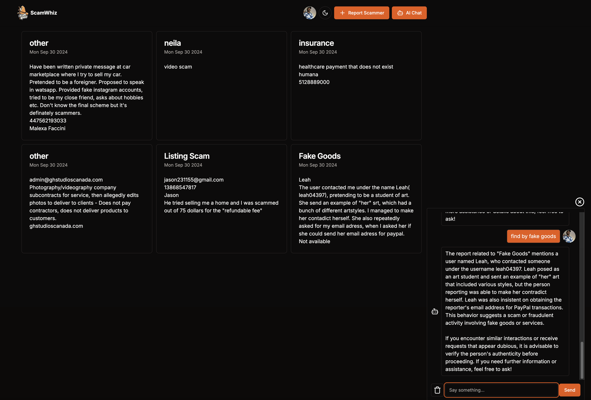

# ScamWhiz - Generative AI App for Scam Database


This is a GPT-4-Mini-powered scam, radar, finder and reporting app with an integrated **generative AI chatbot**.

By using **OpenAI SDK**, **vector embeddings**, **Pinecone**, and **MongoDB**, the chatbot knows about all scam reports stored in the MongoDB database and can retrieve relevant information to answer your questions and summarize information.

**Response streaming** is implemented via the **Vercel AI SDK**.

Report a scam and find a scammer online. Enter a text of any suspicious Message, Username, Pseudo Name, Email, Phone Number, crypto address, website, or DM, and ScamWhiz will let you know if it's a scam or not. Built with OpenAI, Pinecone, Clerk, Next/React, and more.



#### Try it!

Let's try it out! Here are some questions you could try asking:

- Hi
- What can you do?
- Bogus sweepstakes
- Fake prizes
- Find video scam
- Free gifts
- Who is neila?

---



# Built With

Languages, frameworks, platforms, cloud services, databases, APIs, anf other technologies used:

- Next/React
- TypeScript
- Clerk
- Prisma ORM
- MongoDB
- OpenAI API
- Pinecone
and more

# Installation

Steps to install and setup the project:

1. **Clone the repository**

   Open  terminal and run the following command:

   ```bash
   git clone git@github.com:mikoaro/scamwhiz.git
   ```

2. **Navigate to the project directory**

   ```bash
   cd scamwhiz
   ```

3. **Install Node.js**

   The project requires Node.js. You can download it from [here](https://nodejs.org/en/download/).

4. **Install the required dependencies**

   Run the following command to install all the required dependencies:

   ```bash
   npm install
   ```

   This will install all the dependencies listed in the `package.json` file, including Next.js, React, and other specific dependencies. Flag --legacy-peer-deps may be needed for much older dependencies.

5. **Setup environment variables**

    Copy or move a `.env.template` file to the `.env` file in the root directory of your project and add the required environment variables.

6. **Run the project**

    Now, you can run the project using the following command:

    ```bash
    npm run dev
    ```

    Open [http://localhost:3000](http://localhost:3000) with your browser to see the result.

## 📈 Next steps

Feel free to extend this app in any way you like. Here are some ideas for next steps:

- Support more file formats
- Pull in documents via API
- Add search with AI on in the input field
- Add search with AI off in the input field
- Perform RAG on images using OpenAI CLIP embeddings - Upload a pic or screenshot
- Perform RAG on audio and video clips upload 
- Support Card or Table View of reports
- Add more fields to the report dialog
- Add sample historic reports
- Support for PDF split and PDF download of reports to be shared others
- Better categorization of supported report types
- Sample history of recently reported scams on the home page
- Report statistics by day, month, and year
